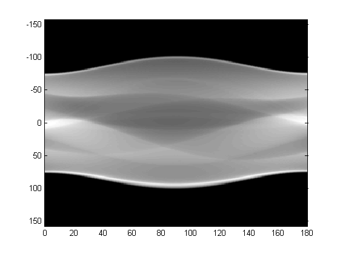

.. badblock documentation master file, created by
   sphinx-quickstart on Thu Mar  7 09:42:25 2019.
   You can adapt this file completely to your liking, but it should at least
   contain the root `toctree` directive.

Prepare your data
====================================

The size(shape) and the distribution of the data would affect both the performance and the learning speed of the network, and hence reshaping or preprocessing the raw data to the shape/distribution we want and post-processing it back to the origin format are usually common in machine learning [The reasons behind this are a lot, say we want the learning converge similar to all directions in our training data]. In most the cases, the methods include but not limit to normalization, reshaping, etc. 

Know our raw data
^^^^^^^^^^^^^^^^^^^^^^^^^^^

Before we prepare/process our data, it would be better if we know what data we are going to train/learn. For example, for images, we can view the images by using::

	plt.imshow(image)

where plt is short for matplotlib.pylab. In this way, we can have a roughly idea about our dataset/image.

In the following, I give two examples about the data we deal with for medical imaging, sinograms and images.

eg. Sinograms
**********************

PET-CT and PET-MR scanners store the raw data in proprietary formats which can be processed only by the software provided by the scanner manufacturer, where one of the raw data is sinogram, which is basically 2D representation of projection rays versus angle. And different from RGB images, the pixels in sinograms stand for the counts of events captured from the scanner, which range from zero to thousands or tens of thousands.

One sample of sinogram is shown below.

If our goal is to fix the noise in sinograms of one patient, say, we have the sinograms with the format as .s with the input sinograms with noise and the target sinograms without noise. Then, we can use U-Net to project the data from the input files and to make it close to the data in the target file (ground true).

Actually, the practical sinogram file of one patient can be very big, around several GBs, and hence the best way to train is not to feed all the sinograms into memory but to seperate the single sinograms of one patient into small parts, which would be more beneficial to reduce the cost of both memory and learning speed.

eg. Images 
**********************

.. image:: images.PNG
   :width: 300px
   :align: center

To clarify, our final goal can be to fix the noise in body image of one patient (to make the image more clear and help the doctors make good decisions). Thus, rather than working on singrams, another direct solution will be to work on the body images directly. For instance, we feed the reconstructed image with noise into our neural networks as inputs and our target will be the images without noise.

Note, the above noise can also be interperated as impainting.

Process our raw data
^^^^^^^^^^^^^^^^^^^^^^^^^^^
After getting an idea about our dataset, now we can proceed in processing the raw dataset.

Partition
**********************
As stated, to advoid loading all data into the memory, we would better reshape our dataset into more informative matrix and partition the dataset into smaller pieces. In a large scale, the memory consumption will be reduced and the learning speed will be accelerated. However, we might also lose the relations/connections among the smaller pieces. 

For an example, I am working on sinograms and the sinograms have their own informative structure [TOF, Slice, W, L], where TOF stands Time of Flight, Slice stands the slices of the sinogram, W, L stand for the rays versus angle. After reshaping the dataset from [TOF, Slice, W, L] into [TOF*Slice, W, L],  I feed the network with the sinogram based on slice. For example, for each slice, the sinogram has the shape [W, L]. In this way, we could definitely reduce the cost of memory, but we also lose the correlative information among slices. 

Padding
**********************
For most cases in machine learning without down/up sampling in the images, the number of W and L does not matter. Since we are working on UNet (as autoencoder, we need to encode and decode the data) we would better make W and L as a power of 2 (since we will consider the network structure as UNet which will include both downsampling and upsampling).

In this case, if W and L is close to certain number which is a power of 2, and then we can match W and L to the numbers by using padding in numpy.

.. note::
   An example of reshaping to a power of 2:

	`Numpy <http://www.numpy.org/>`_ provides the padding function::

	    data = np.pad(data, ((x1, y1), (x2, y2), (x3, y3), (x4, y4)), 'wrap') 

	For example, if we have [TOF=1, Slice=1, W=50, L=256], we can do::

	    data = np.pad(data, ((0, 0), (0, 0), (7, 7), (0, 0)), 'wrap')

	to make it [TOF=1, Slice=1, W=64, L=256], which would be good enough for 3 times downsampling since W and L can be divided by :math:`2^3`.

Normalization
**********************

Normalization is usualy called to change the values of numeric columns in the dataset to a common scale, without distorting differences in the ranges of values. And there are plenties of methods which can be utilized and explored. Here I proposed the most easy one by mapping the dataset to [0,1].

The code can be easily in Python as::

	data = data / (data.max() + 1e-8)

The small value 1e-8 is necessary, especially when the values of the images are integer. In this way, we can map the value to float while between 0 and 1.

   Here I only list one way to change the shape, and actually there might be tons of other methods which are good to try for the data processing.

Save the data in pickle
^^^^^^^^^^^^^^^^^^^^^^^^^^^
In order to make dataset read more efficiently by python, we save the reshaped dataset into pickle as the intermedium files for the datasets. `Pickle <https://docs.python.org/3/library/pickle.html>`_ module implement binary protocols for serializing and de-serializing a Python object structure. 

e.g. we can dump our reshaped matrix directly into pickle by using::

    pickle.dump(data, f, pickle.HIGHEST_PROTOCOL)
        
.. note::
   Be careful with you pickle version, since it might not match between python2 and python3.

One example about how to process the dataset is summarized as::

    def process_data(self, file, tof, slices, theta, dist):

        data = np.fromfile(file, dtype='uint16')
        data = data.reshape((tof, slices, theta, dist))  # Reshape to the file layout

        data = np.pad(data, ((0, 0), (7, 7), (0, 0)), 'wrap')

        return data

    result = process_data(file, tof, slices, theta, dist)

    with open("savefile.pkl", 'wb') as f:
    	pickle.dump(result, f, pickle.HIGHEST_PROTOCOL)

The details of the data process can be refered from sino_process_tof.py

.. warning::
   
   Loading all the data into the GPU is both time consuming and inefficient and hene balancing the between the size before training.

Load your data in batch
^^^^^^^^^^^^^^^^^^^^^^^^^^^^^^^^^^^^^^^^^^^^^^^^^^^^^^^^^^^^^^^^^^^^^^^^^^^^^^^^^^^^^^^

Load from dataset class in Pytorch
******************************************
Before we start, let's see how pytorch works with dataset. Pytorch a Python-based scientific computing package targeted at two sets of audiences:

* A replacement for NumPy to use the power of GPUs
* a deep learning research platform that provides maximum flexibility and speed

In fact, pytorch has listed very good tutorial for beginners, so I will omit this part here while you can find easily online.

`Links to Pytorch Tutorial <https://pytorch.org/tutorials/beginner/blitz/tensor_tutorial.html#sphx-glr-beginner-blitz-tensor-tutorial-py/>`_

PyTorch provides many tools to make data loading easy and hopefully, to make your code more readable. For instance, the abstract class in pytorch **torch.utils.data.Dataset** is the main class to call for loading data, and mainly two methods would be called.

* __len__: which returns the size/length of the dataset
* __getitem__: which returns one sample of the dataset based on the index, such that dataset[i] for index i

In our case, we can define the class :code:`class Sino_Dataset(dataset)` inherits from :code:`torch.utils.data.Dataset`

Here, the length of the dataset is::

    def __len__(self):

        return self.epoch_size

and the item of the dataset is::

   def __getitem__(self, idx):
	
	return self.data[idx]

the :code:`self.data.shape=[tof*slice, W, L]`

The details of getting item also include shuffling and file updating, which can be viewed as different methods to improve the randomness of the data set.

Augument the data randomly while loading
********************************************
I have been told that the data is very expensive, so if we do not have enough data for training, what should we do?

For images, we can do image augmentation to expand the datsets. There are lot of ways to do the augmentation, such as flipping, zooming and so on. I have found one package from github `<https://github.com/mdbloice/Augmentor>`_ , which can be utilized easily as::

	images = [[image for image in corrupt_sino] + [orig_sino[0]]]
		        p = Augmentor.DataPipeline(images)
		        # p.rotate(1, max_left_rotation=5, max_right_rotation=5)
		        # p.flip_top_bottom(0.5)
		        # p.zoom_random(1, percentage_area=0.5)
		        p.rotate(probability=0.7, max_left_rotation=10, max_right_rotation=10)
		        p.zoom(probability=0.5, min_factor=1.1, max_factor=1.5)
		        augmented_images = p.sample(1)
		        corrupt_sino = np.stack([augmented_images[0][i] for i in range(5)])
		        orig_sino = np.stack([augmented_images[0][i] for i in range(5, 6)])

In this way, the images have been augumented. Other methods are also welcome!

